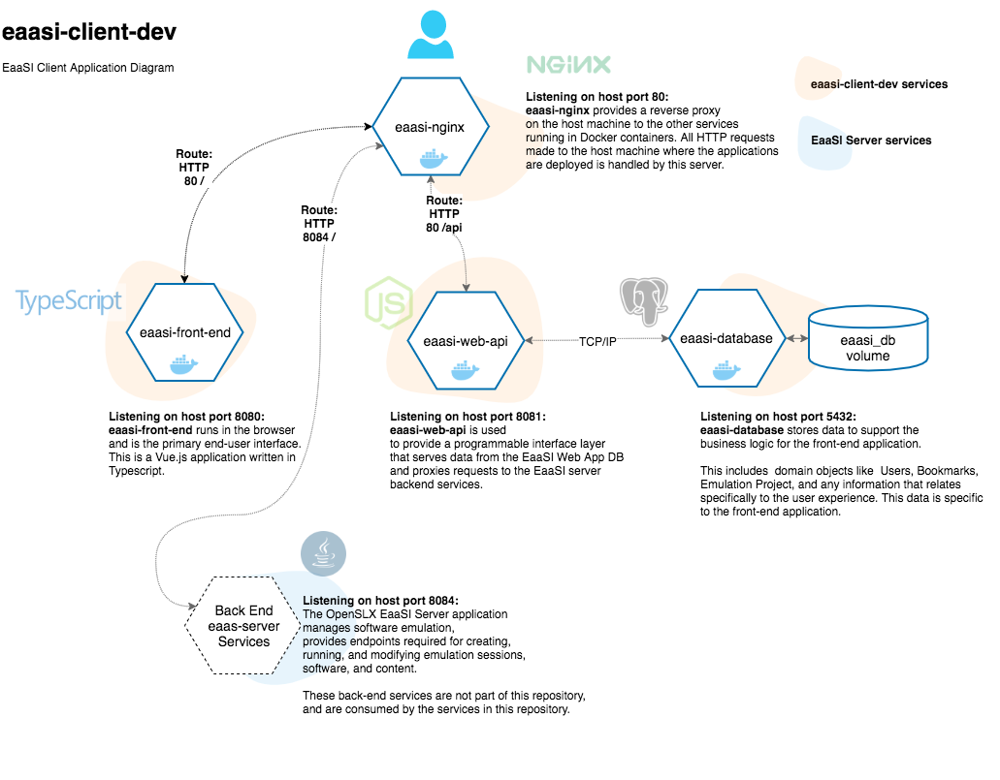

# eaasi-client-dev

## Summary
This repository contains the Vue + Express + PostgreSQL + nginx EaaSI application.

---
## Architecture Diagram



## Configuration

To run the application in production mode, create an `.env.production` file in the following locations:

- `./eaasi-web-api/.env`
- `./eaasi-front-end/.env`

Failure to create `.env.production` files before deploying the application with `docker-compose` will result in complete loss of functionality.
Example `.env.development` files are provided in the root of each project for reference.

> Note: When the containers are run using `docker-compose`, they are automatically networked and can communicate with each other using their specified container names.
> See [https://docs.docker.com/compose/networking/](Networking in Compose), for example. Note the implementation in the project's `nginx.conf` and the production mode database settings in the API project.

## Running the Application

The `eaasi-client-dev` project consists of four layers - a Vue.js front end app (presentation), an Express.js web API (service), a PostgreSQL database (persistence), an nginx web server (reverse proxy).

Each part of the application can be run independently using tooling provided in each project (or, in the case of the database or web server, by using locally running instances).

Additionally, the entire application can be deployed and run using `docker-compose`.

### Containerization

A `docker-compose.yml` provides a containerization spec for the application.

Postgres data is stored in a Docker volume so that data persists independently of the container that runs PostgreSQL.

#### Makefile

To run the application using `docker-compose`, in the root of the project, run:

```
make build-run
```

This will build four containers.

The `docker-compose.yml` configuration specifies four services:

  - `eaasi-nginx`
  - `eaasi-database`
  - `eaasi-front-end`
  - `eaasi-web-api`

and a volume `eaasi_db`.


## Project Structure

### eaasi-front-end

This directory contains the Vue.js front end application.


### eaasi-web-api

This directory contains the Express.js web API, which serves as a proxy to the OpenSLX `eaas-server` and provides a service layer for the front end.


### eaasi-database

This directory contains scripts related to the PostgreSQL database that provides client application state.


### eaasi-nginx

This directory contains an nginx configuration (and several alternative variations) for running the applications behind a reverse proxy.  The default setup is configured to run all applications on the same host.

Note that the configuration will need to be manually updated to suit the target deployment environment.

Additional configurations are provided to route to subdomains for all or part of the application services.
